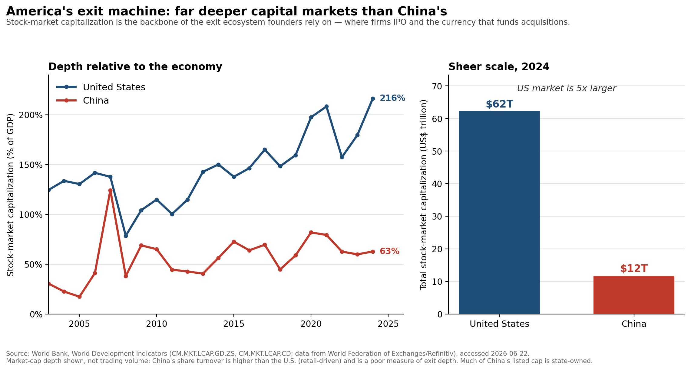

# Exhibit Document — "Founders as the Next Offset"

**Deliverable 1.** Three exhibits supporting the argument that America's founder
class is its decisive asset in the techno-economic competition with China. Each
entry contains the exhibit, a plain-English annotation written for a smart
non-economist, and a full source citation. Figures are reproducible from the
scripts in [`code/`](../code); see the repository [README](../README.md).

**Author:** Felix Aidala · **Prepared for:** Cardinal40 (Economist role) · **Date:** June 2026

The three exhibits trace one logical chain:

1. **Where frontier talent now works** — innovation has moved from the academy into industry and company-building (the "multi-industry moment").
2. **Why the founder specifically matters** — founders are not interchangeable managers; remove them and innovation measurably falls.
3. **Why America's system wins** — the U.S. has a vastly deeper exit machine to finance, reward, and recycle those founders than China does.

---

## Exhibit 1 — New U.S. science & engineering PhDs now go to industry, not academia


**Annotation.** Among newly minted U.S. science-and-engineering PhDs who take a
definite job (not a postdoc), the share heading into industry has overtaken the
share heading into academia — the two lines cross in the 2009–2014 window, and by
2024 industry leads 52% to 30%, a ~29-point swing in the gap since 1994. The
headline for the writer: the most highly trained technical talent in America
increasingly does its frontier work inside companies, not universities — the
empirical backbone for "the locus of innovation has shifted to industry and
founders." **Nuance not to overclaim:** this measures *first-destination
commitments of those who go straight to work*, so it understates the academic
pipeline that runs through postdocs, and it is a statement about *where talent
goes*, not a direct measurement of *where the best science happens*. The 2021 CIP
field-taxonomy change means field-level splits (e.g., engineering) have a small
pre/post-2021 comparability break; the all-S&E aggregate shown here is robust to
it.

**Source.** National Center for Science and Engineering Statistics (NCSES),
*Survey of Earned Doctorates*, 2024 cycle. Table 2-6, "Employment sector of
research doctorate recipients with definite postgraduation commitments for
non-postdoc employment in the United States, by trend broad field of doctorate:
Selected years, 1994–2024." NSF 25-349.
URL: https://ncses.nsf.gov/pubs/nsf25349/assets/data-tables/tables/nsf25349-tab002-006.pdf
Accessed 2026-06-22. *Variable construction:* percentages are over doctorate
recipients reporting a definite non-postdoc U.S. employment commitment; "industry
or business" includes self-employment. *Coverage:* U.S.-trained research
doctorates, selected years 1994–2024. Raw values in
[`data/raw/sed_table2-6_employment_sector.csv`](../data/raw/sed_table2-6_employment_sector.csv).

---

## Exhibit 2 — Founders are not interchangeable managers


**Annotation.** Using CEO *sudden deaths* at U.S. public firms (1979–2002) as a
natural experiment — so the change of leadership is unrelated to how the firm was
already doing — Lee, Kim & Bae (2020) find that an exogenous switch from a
founder-CEO to a professional CEO is associated with a **43.8% drop in
citation-weighted patent output**, even after controlling for R&D spending. The
headline for the writer: this is the cleanest available answer to the skeptic who
says "a good manager can run the company once it's built" — the data say no, the
founder is doing something that does not transfer. The mechanism matters and is
quotable: the effect is *not* that founders spend more on R&D (they don't); it's
that they manage and **retain** innovative people — inventors leave after a
founder is replaced. **Nuance not to overclaim:** this is one well-identified
study of *public* firms over a historical window, about *patent-based* innovation
specifically; it is strong evidence that founders matter, not proof that every
founder should stay forever. We **present the paper's published estimates** — we
did not re-run the study (its sudden-death dataset is hand-collected and not
redistributable).

**Source.** Lee, Joon Mahn; Kim, Jongsoo; Bae, Joonhyung (2020). "Founder CEOs
and innovation: Evidence from CEO sudden deaths in public firms." *Research
Policy* 49(1), 103862. DOI: 10.1016/j.respol.2019.103862.
Record: https://ideas.repec.org/a/eee/respol/v49y2020i1s0048733319301817.html
Accessed 2026-06-22. *Method:* event-study/natural-experiment using exogenous
CEO sudden deaths; outcome is citation-weighted patent count, controlling for R&D.
Reported estimates transcribed to
[`data/raw/lee_kim_bae_2020_estimates.csv`](../data/raw/lee_kim_bae_2020_estimates.csv).

---

## Exhibit 3 — America's exit machine: far deeper capital markets than China's



**Annotation.** Deep, liquid public-equity markets are the backbone of the exit
ecosystem founders depend on — the place companies IPO and the currency that
funds acquisitions — and on this measure the U.S. dwarfs China: U.S. stock-market
capitalization is ~216% of GDP vs. China's ~63% (3.4× deeper relative to the
economy) and ~$62 trillion vs. ~$12 trillion in absolute size (~5× larger) in
2024. The headline for the writer: America's structural advantage isn't only that
it produces founders — it's that it can *finance the swing, reward the win, and
recycle the capital*, which is exactly the flywheel a thinner exit market starves.
**The nuance a reader (and a careful critic) might miss:** we deliberately use
market-cap *depth*, not trading volume — China's share turnover is actually
*higher* than the U.S. (≈186% vs. 148% of GDP in 2024), but that reflects retail
speculation, not exit capacity, so it would mislead. Two further caveats: public
markets are a *proxy* for the whole exit ecosystem (M&A and secondaries also
matter), and a large share of China's listed value is state-owned with capital
controls limiting exit and repatriation — so China's *usable* exit depth for a
private investor is arguably thinner still.

**Source.** World Bank, *World Development Indicators* (underlying data: World
Federation of Exchanges / Refinitiv). Indicators CM.MKT.LCAP.GD.ZS (market
capitalization, % of GDP), CM.MKT.LCAP.CD (market capitalization, current US$),
and CM.MKT.TRAD.GD.ZS (stocks traded, % of GDP — context only). Pulled via the
World Bank API, accessed 2026-06-22; snapshot cached in
[`data/raw/worldbank_market_depth.csv`](../data/raw/worldbank_market_depth.csv).
*Coverage:* United States and China, 2003–2024 (absolute market cap available
through 2025). API docs: https://datahelpdesk.worldbank.org/.

---

### How to reproduce

```bash
pip install -r requirements.txt
python code/exhibit1_stem_phd_pathways.py
python code/exhibit2_founder_ceo_innovation.py
python code/exhibit3_exit_market_depth.py   # add --refresh to re-pull World Bank data
```

Each script prints the key figures it computes and writes its figure to this
folder. Methodological choices are documented at the top of each script and in
the annotations above.
