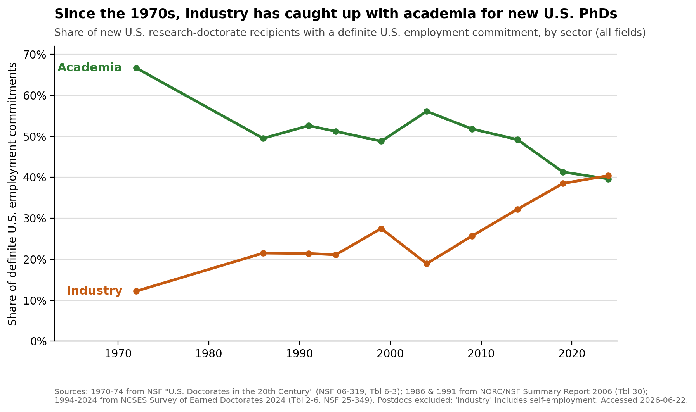
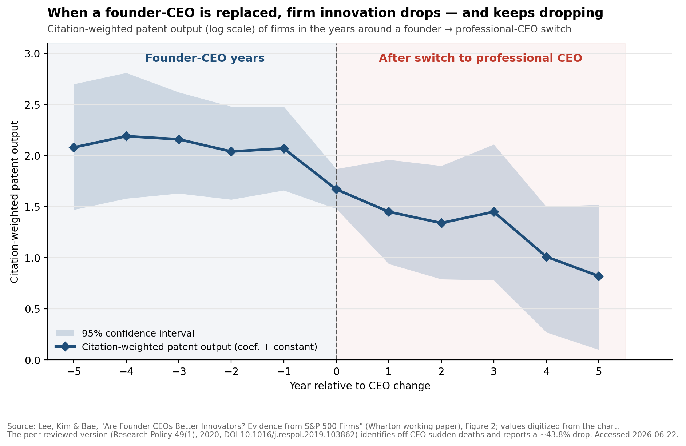
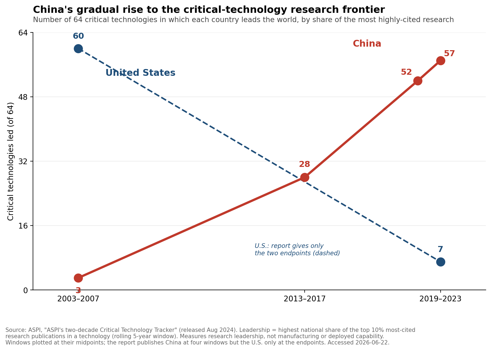

# Exhibit Document — "Founders as the Next Offset"

**Deliverable 1.** Three exhibits supporting the argument that America's founder
class is its decisive asset in the techno-economic competition with China. Each
entry contains the exhibit, a plain-English annotation written for a smart
non-economist, and a full source citation. Figures are reproducible from the
scripts in [`code/`](../code); see the repository [README](../README.md).

**Author:** Felix Aidala · **Prepared for:** Cardinal40 (Economist role) · **Date:** June 2026

The three exhibits trace one logical chain:

1. **Where frontier talent now works** — innovation has moved from the academy into industry and company-building (the "multi-industry moment").
2. **Why the founder specifically matters** — founders are not interchangeable managers; remove them and innovation measurably falls.
3. **Why America's system wins** — the U.S. has a vastly deeper exit machine to finance, reward, and recycle those founders than China does.

---

## Exhibit 1 — Since the 1970s, industry has caught up with academia for new U.S. PhDs



**Annotation.** Over half a century, the destination of new U.S. PhDs who take a
definite job (not a postdoc) has been transformed: academia's share fell from
about two-thirds (67%) in the early 1970s to ~40% in 2024, while industry's rose
from ~12% to ~40% — the two are now essentially even. The headline for the
writer: the academic career has gone from *the* default to one of two co-equal
paths, as the country's most highly trained talent steadily reallocates toward
industry and company-building. **The nuance that strengthens the thesis:** this
chart is *all fields*; within **science & engineering specifically**, the shift
is far sharper — industry rose from 22% (1970–74) to **52%** (2024) while
academia fell from 58% to **30%**, so in exactly the technical fields the offset
depends on, industry has *decisively* overtaken the university. **What not to
overclaim:** this measures *first destinations* of those going straight to work
(postdocs excluded), not *where the best science happens*; the 2004 academic
uptick is a real post-dot-com blip, not noise; and the pre-1994 points come from
earlier SED report vintages (same measure — the series agree where they meet),
with the academic decline concentrated in the 1970s.

**Sources.** Three vintages of the same NSF/NCSES measure (sector of new research
doctorate recipients with a definite U.S. employment commitment; postdocs
excluded; "industry" includes self-employment):
(1) **1970–74** — NSF/SRS (2006), *U.S. Doctorates in the 20th Century*, NSF
06-319, Table 6-3 (five-year average). 
(2) **1986, 1991** — NORC/NSF, *Doctorate Recipients from U.S. Universities:
Summary Report 2006*, Table 30 (selected years 1986–2006).
URL: https://www.norc.org/content/dam/norc-org/pdfs/SED_Sum_Rpt_2006.pdf
(3) **1994–2024** — NCSES, *Survey of Earned Doctorates 2024*, Table 2-6, NSF
25-349.
URL: https://ncses.nsf.gov/pubs/nsf25349/assets/data-tables/tables/nsf25349-tab002-006.pdf
All accessed 2026-06-22. The 1994–2024 segment uses the single current NCSES
trend table (no vintage-mixing within it). Per-point sourcing in
[`data/raw/sed_table2-6_employment_sector.csv`](../data/raw/sed_table2-6_employment_sector.csv)
and
[`data/raw/sed_historical_employment_sector_allfields.csv`](../data/raw/sed_historical_employment_sector_allfields.csv).

---

## Exhibit 2 — Founders are not interchangeable managers



**Annotation.** This is the authors' own event study of firms that switched from
a founder-CEO to a professional CEO. Citation-weighted patent output (log scale)
runs flat and high through the founder years (~2.1), then drops sharply *at the
switch* (year 0) and keeps falling for five years. The headline for the writer:
the decline begins exactly at the handover, not before it — the flat pre-trend is
what makes "the firm was just on the way down anyway" hard to argue, and is the
cleanest available answer to the skeptic who says a professional manager can run
the company just as well once it's built. **Nuance not to overclaim:** the
shaded 95% confidence band widens after the switch, so the *later* post-switch
points are imprecisely estimated; read the result as the clear break at year 0
plus the published magnitude, not as a precise year-by-year path. **The
rigorously-identified magnitude** comes from the peer-reviewed version, which
isolates causation using CEO *sudden deaths* and reports a **~43.8% drop in
citation-weighted patents** (controlling for R&D — founders manage and *retain*
inventors better, they don't simply spend more). We **present the authors'
figures**; we did not re-run the analysis (their data are not redistributable).

**Sources.** *Event-study figure:* Lee, Joon Mahn; Kim, Jongsoo; Bae, Joonhyung,
"Are Founder CEOs Better Innovators? Evidence from S&P 500 Firms" (Wharton Mack
Institute working paper; S&P 500, 1993–2003), **Figure 2**, "Switching from
Founder CEO to Professional CEO." Values digitized from the published chart
(±~0.03 reading error) into
[`data/raw/lee_kim_bae_fig2_event_study.csv`](../data/raw/lee_kim_bae_fig2_event_study.csv).
URL: https://mackinstitute.wharton.upenn.edu/wp-content/uploads/2016/03/Mahn-Lee-Joon-Kim-Jongsoo-and-Bae-Joonhyung_Are-Founder-CEOs-Better-Innovators.-Evidence-from-SP-500-Firms.pdf
*Headline magnitude (corroboration):* Lee, J.M., Kim, J., & Bae, J. (2020),
"Founder CEOs and innovation: Evidence from CEO sudden deaths in public firms,"
*Research Policy* 49(1), 103862, DOI 10.1016/j.respol.2019.103862; key estimates
in [`data/raw/lee_kim_bae_2020_estimates.csv`](../data/raw/lee_kim_bae_2020_estimates.csv).
*Method:* the figure plots the coefficient-plus-constant from a firm
fixed-effects panel OLS of ln(1 + citation-weighted patent count) on
year-relative-to-switch dummies. All accessed 2026-06-22.

---

## Exhibit 3 — The flip: China's rise to the critical-technology research frontier



**Annotation.** This is the evidence behind the essay's opening claim that "as
late as 2007 the U.S. led in the overwhelming majority of these categories — today
the numbers have flipped." Across the 64 critical technologies ASPI tracks, the
U.S. led 60 (and China 3) in 2003–2007; China then drew level in the mid-2010s
(leading 28 by 2013–2017) and pulled decisively ahead, leading 57 of 64 in
2019–2023 while the U.S. fell to 7. The headline for the writer: this is the alarm
bell — and the time series shows the switch was *gradual and consistent*, not a
sudden jump, which makes it harder to dismiss as a blip. **The nuance that is also
the bridge to the rest of the argument:** ASPI measures *research leadership* —
each country's share of the world's most highly-cited publications — an *upstream,
leading* indicator, **not** manufacturing, commercialization, or deployed
capability. So the right read is "China is now generating more of the frontier
*ideas*," not "China has already won"; the gap between leading in research and
turning research into world-changing companies is the space the founder thesis
occupies (Exhibits 1–2). **What not to claim:** don't equate "leads in research"
with "dominates the market"; the small remainder of the 64 technologies is led by
other countries (e.g., UK, India); and note that the **U.S. line is drawn from the
two published endpoints only** (ASPI's report gives China's count at four windows
but the U.S.'s at just 2003–2007 and 2019–2023), so it shows direction, not a
precise year-by-year path.

**Source.** ASPI (Australian Strategic Policy Institute), *ASPI's two-decade
Critical Technology Tracker: The rewards of long-term research investment*,
released August 2024.
URL: https://www.aspi.org.au/report/aspis-two-decade-critical-technology-tracker/
Accessed 2026-06-22. *Variable construction:* a country "leads" a technology if it
has the highest national share of the world's high-impact research output — the
top 10% most highly cited publications — in that technology, measured over a
five-year window; 64 critical technologies are tracked. *Coverage:* global
research output, comparing 2003–2007 with 2019–2023. Values in
[`data/raw/aspi_critical_tech_tracker.csv`](../data/raw/aspi_critical_tech_tracker.csv).

---

### How to reproduce

```bash
pip install -r requirements.txt
python code/exhibit1_stem_phd_pathways.py
python code/exhibit2_founder_ceo_innovation.py
python code/exhibit3_critical_tech_leadership.py
```

Each script prints the key figures it computes and writes its figure to this
folder. Methodological choices are documented at the top of each script and in
the annotations above.
