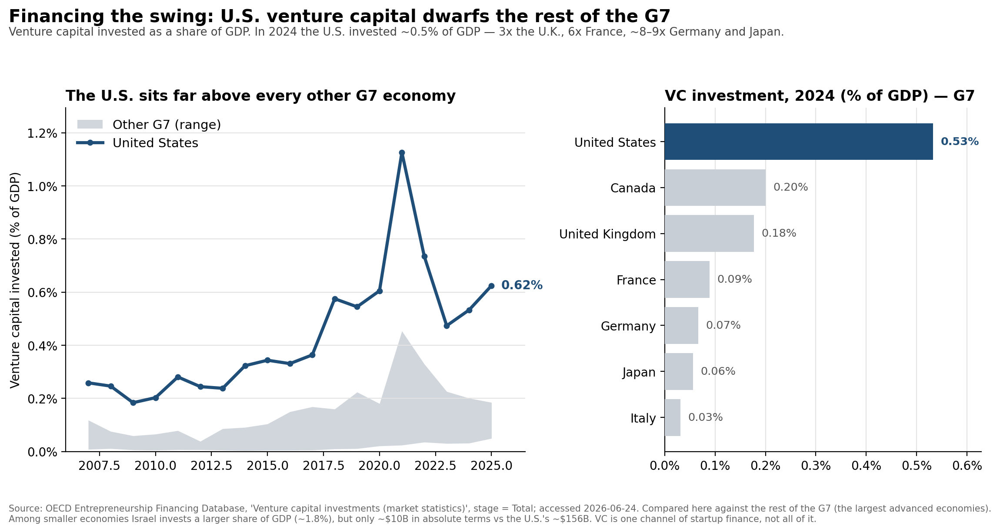

# Exhibit Document — "Founders as the Next Offset"

**Deliverable 1.** Three exhibits supporting the argument that America's founder
class is its decisive asset in the techno-economic competition with China. Each
entry contains the exhibit, a plain-English annotation written for a smart
non-economist, and a full source citation. Figures are reproducible from the
scripts in [`code/`](../code); see the repository [README](../README.md).

**Author:** Felix Aidala · **Prepared for:** Cardinal40 (Economist role) · **Date:** June 2026

**Supporting materials.** Full code, data, and step-by-step reproduction
instructions are in the project's GitHub repository:
[github.com/felix-aidala/Cardinal40-Technical](https://github.com/felix-aidala/Cardinal40-Technical).
The complete log of substantive AI-tool interactions — how each tool was used and
how AI-generated statistics and citations were independently verified — is at
[`logs/ai_interaction_log.md`](https://github.com/felix-aidala/Cardinal40-Technical/blob/main/logs/ai_interaction_log.md).

The three exhibits trace one logical chain:

1. **Where frontier talent now works** — innovation has moved from the academy into industry and company-building.
2. **Why the founder specifically matters** — founders are not interchangeable managers; remove them and innovation measurably falls.
3. **Why America's system wins** — the U.S. funds its founders at a scale no peer economy approaches, which is why it (not its allies) is the one equipped to challenge China.

---

## Exhibit 1 — Since the 1970s, industry has caught up with academia for new U.S. PhDs


**Annotation.** This figure anchors the essay's opening claim: that the locus of
American technological advantage has shifted since the Second World War and the
Cold War that followed. The scientists who built the first nuclear weapons were
largely academics, working for the federal government on leave from their
universities;
today the equivalent talent — the country's most capable new PhDs — increasingly
leaves the academy for industry, where it builds and leads America's frontier
companies (Anthropic among them). That steady migration of scientific talent into
the private sector is what the figure is meant to show, and it is what motivates
the investment thesis that follows. Two cautions are worth stating plainly. First,
to recover a picture reaching this far back I had to use all fields rather than
science and engineering alone, so these are not exclusively technical PhDs.
Second, the chart shows talent moving *into industry*, not talent *becoming
founders* — I am careful not to imply the latter, because the great majority of
these scientists never start a company. The claim is the narrower and more
defensible one: the frontier of scientific work now sits inside industry.

**Sources.** Three vintages of the same NSF/NCSES measure (sector of new research
doctorate recipients with a definite U.S. employment commitment; postdocs
excluded; "industry" includes self-employment):
(1) **1970–74** — NSF/SRS (2006), *U.S. Doctorates in the 20th Century*, NSF
06-319, Table 6-3 (five-year average). 
(2) **1986, 1991** — NORC/NSF, *Doctorate Recipients from U.S. Universities:
Summary Report 2006*, Table 30 (selected years 1986–2006).
URL: https://www.norc.org/content/dam/norc-org/pdfs/SED_Sum_Rpt_2006.pdf
(3) **1994–2024** — NCSES, *Survey of Earned Doctorates 2024*, Table 2-6, NSF
25-349.
URL: https://ncses.nsf.gov/pubs/nsf25349/assets/data-tables/tables/nsf25349-tab002-006.pdf
All accessed 2026-06-22. The 1994–2024 segment uses the single current NCSES
trend table (no vintage-mixing within it). Per-point sourcing in
[`data/raw/sed_table2-6_employment_sector.csv`](../data/raw/sed_table2-6_employment_sector.csv)
and
[`data/raw/sed_historical_employment_sector_allfields.csv`](../data/raw/sed_historical_employment_sector_allfields.csv).

---

## Exhibit 2 — Founders are not interchangeable managers


**Annotation.** This figure speaks to the distinctive skillset a founder brings —
and to whether the person who builds a company can be swapped for a professional
manager once it is built. It is an event study drawn directly from Lee, Kim, and
Bae (2020): when a founder-CEO exits unexpectedly, citation-weighted patents, a
standard proxy for innovation, fall. Event studies can be confusing on a first
read, because they plot a difference-in-differences rather than a simple time
trend. Given more time, I would replicate the authors' analysis myself so the
figure could show the treated and comparison groups as separate lines. **Nuance
not to overclaim:** this is just one academic paper, so it should be presented as
a finding rather than a fact. Also, I present the authors' figures; I did not
re-run the analysis myself.

**Sources.** *Event-study figure:* Lee, Joon Mahn; Kim, Jongsoo; Bae, Joonhyung,
"Are Founder CEOs Better Innovators? Evidence from S&P 500 Firms" (Wharton Mack
Institute working paper; S&P 500, 1993–2003), **Figure 2**, "Switching from
Founder CEO to Professional CEO." Values digitized from the published chart
(±~0.03 reading error) into
[`data/raw/lee_kim_bae_fig2_event_study.csv`](../data/raw/lee_kim_bae_fig2_event_study.csv).
URL: https://mackinstitute.wharton.upenn.edu/wp-content/uploads/2016/03/Mahn-Lee-Joon-Kim-Jongsoo-and-Bae-Joonhyung_Are-Founder-CEOs-Better-Innovators.-Evidence-from-SP-500-Firms.pdf
*Headline magnitude (corroboration):* Lee, J.M., Kim, J., & Bae, J. (2020),
"Founder CEOs and innovation: Evidence from CEO sudden deaths in public firms,"
*Research Policy* 49(1), 103862, DOI 10.1016/j.respol.2019.103862; key estimates
in [`data/raw/lee_kim_bae_2020_estimates.csv`](../data/raw/lee_kim_bae_2020_estimates.csv).
*Method:* the figure plots the coefficient-plus-constant from a firm
fixed-effects panel OLS of ln(1 + citation-weighted patent count) on
year-relative-to-switch dummies. All accessed 2026-06-22.

---

## Exhibit 3 — Financing the swing: U.S. venture capital dwarfs the rest of the G7



**Annotation.** The first two exhibits establish that frontier talent now sits in
industry and that founders specifically are hard to replace. This figure attempts
to display America's unique ability to support them. Relative to the size of its
economy, the U.S. invests far more than any other G7 country — roughly 0.5% of
GDP in 2024, about 3× the U.K., 6× France, and 8–9× Germany and Japan. **Why show
peers rather than just China:** the contest with China is usually framed as a
two-country race, but particularly as the EU aims to lower its reliance on the
United States, it's worth making the point that the capacity to finance founders
at scale is what determines who can credibly *challenge* Beijing. On that measure,
the U.S. stands alone even among its closest allies. This lets us expand the
argument slightly. Showing the U.S. against its own peer group demonstrates that
America is the one country actually equipped to mount the challenge. **Nuance not
to overclaim:** the U.S. is not the world leader on this ratio — *Israel* invests
a larger share of its GDP (~1.8%). I scope the comparison to the G7, the large
advanced economies where the U.S. leads.

**Source.** OECD, *Entrepreneurship Financing Database*, "Venture capital
investments (market statistics)," dataflow `DSD_VC@DF_VC_INV`, business
development stage = Total. Units used: venture capital as a percentage of GDP, and
absolute US$ (exchange-rate converted) for the scale comparison. Pulled via the
OECD SDMX API, accessed 2026-06-24; snapshot cached in
[`data/raw/oecd_vc_gdp.csv`](../data/raw/oecd_vc_gdp.csv).
*Coverage:* 37 reporting economies, 2002–2025; the figure uses 2024, the latest
year with full G7 coverage, for the cross-section and 2006–2024 for the trend.
Data Explorer: https://data-explorer.oecd.org/vis?df%5Bid%5D=DSD_VC@DF_VC_INV.

---

### How to reproduce

```bash
pip install -r requirements.txt
python code/exhibit1_stem_phd_pathways.py
python code/exhibit2_founder_ceo_innovation.py
python code/exhibit3_vc_gdp.py
```

Each script prints the key figures it computes and writes its figure to this
folder. Methodological choices are documented at the top of each script and in
the annotations above.
